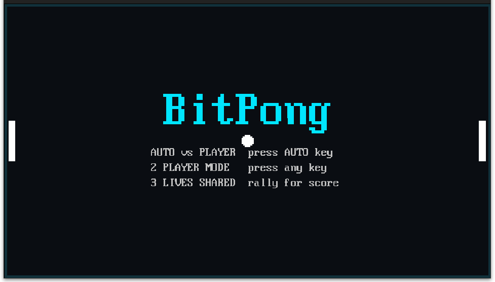
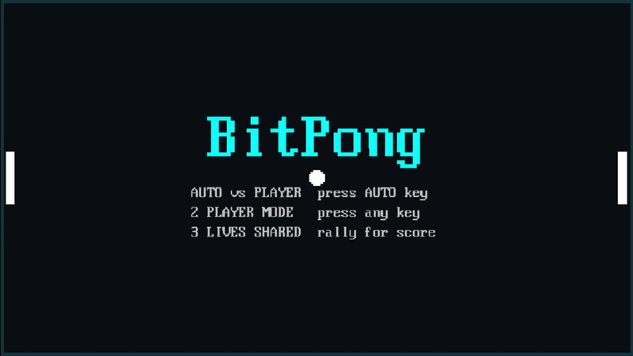

# BitPong

A hardware Pong game written entirely in Verilog, targeting **1920×1080 HDMI output** on a **Gowin FPGA** board.  
The game runs at native 1080p/60 Hz with no CPU, no OS, just synchronous RTL driving pixels straight to your monitor over a DVI/HDMI cable.

---
<div align="center">



</div>

## What it looks like in action


<div align="center">

[](assets/bitpong_demo.mp4)

</div>


---

## Game Modes

| Mode | Description |
|------|-------------|
| **Auto (1P)** | Left paddle is controlled by an auto-player. You play right paddle with configurable keys or predefined `W`/`S`. Press `A` to toggle Auto mode `ON` / `OFF`. |
| **2-Player** | Both paddles are human-controlled. |

Both modes share **3 lives**. Missing the ball costs a life. When all 3 are gone — game over, the player with highest score wins.

---

## Hardware Target

| Item | Value |
|------|-------|
| Board | Tang MEGA 60k |
| PLL output | 148.5 MHz (pixel clock), 742.5 MHz (TMDS serial clock) |
| Resolution | 1920 × 1080 @ 60 Hz |
| Output | DVI / HDMI via TMDS differential pairs |

---

## Directory Structure

```
bitpong/
├── rtl/
│   ├── BitPong/              # All game logic
│   │   ├── bitpong_top.v           # FPGA top-level
│   │   ├── bitpong_graphics.v      # Game state machine + pixel compositor
│   │   ├── bitpong_engine.v        # Physics: ball, paddles, collision
│   │   ├── bitpong_text.v          # HUD + splash screen text renderer
│   │   ├── bitpong_walls.v         # Border and dashed centre line
│   │   ├── bitpong_timer.v         # Countdown timer (NEW_BALL / GAME_OVER)
│   │   ├── score_counter.v         # 2-digit BCD score counter
│   │   ├── bitpong_button_toggle.v # Debounced toggle for AUTO key
│   │   ├── ascii_rom.v             # Synchronous character ROM (BRAM)
│   │   └── font_8x16.mem           # 128-char ASCII font bitmap (hex)
│   └── hdmi                        # hdmi submodule TANG MEGA 60k Board
├── verilator_sim/
│   ├── top_text_sim.sv       # Verilator simulation top for game sim
│   ├── main_text.cpp         # SDL2 display harness
│   ├── top_bound_sim.sv      # Verilator simulation top for bounding walls
│   ├── main_bound.cpp        # SDL2 display harness
│   ├── top_mod_sim.sv        # Verilator simulation for mod
│   ├── main_mod.cpp          # SDL2 display harness
│   └── Makefile
└── README.md
```

---

## Running the Verilator Simulation

The full game can be simulated on your PC using **Verilator + SDL2** — no FPGA required.  
The simulation renders every pixel in real time to a 960×540 window (the 1080p frame scaled to half).

### Prerequisites

```bash
sudo apt install verilator libsdl2-dev   # Ubuntu/Debian
```

### Build and run

```bash
cd sim/
make sim_text
```

That single command:
1. Verilates `top_text_sim.sv` and all dependent RTL files
2. Compiles the C++ SDL2 harness (`main_text.cpp`)
3. Links and launches the simulation window

### Keyboard controls (simulation window)

| Key | Action |
|-----|--------|
| `W` | Player 1 paddle — move **Up** |
| `S` | Player 1 paddle — move **Down** |
| `↑` (Up Arrow) | Player 2 paddle — move **Up** |
| `↓` (Down Arrow) | Player 2 paddle — move **Down** |
| `A` | Toggle **Auto-play** mode (AI takes left paddle) |
| `R` (hold) | Assert **Reset** — releases on key-up |
| `Q` | Quit the simulation |

> **Tip:** The simulation starts with Auto-play ON. Hit `A` once to switch to 2-player mode. Press any movement key on the splash screen to launch the first ball.

### Other simulation targets

```bash
make sim_bound   # Renders border/wall test pattern only
make sim_mod     # Renders standard video test pattern
make clean       # Remove all build artefacts
```

---

## FPGA Build (Gowin)

1. Open Gowin EDA, create a project targeting your board.
2. Add all files under `rtl/` (including the PLL IP).
3. Set `bitpong_top.v` → `top_bitpong` as the top-level module.
4. Add pin constraints — map `p1_up`, `p1_down`, `p2_up`, `p2_down`, `auto_play` to buttons; map the four TMDS pairs to the HDMI connector.
5. Run synthesis → Place & Route → Generate Bitstream → Program.

> **Note:** Board buttons are active-low in hardware. The top-level inverts them (`~p2_up`, `~p2_down`) before passing to game logic. Adjust per your board's schematic.

---

## Design Highlights

- **Zero-CPU architecture** — the entire game runs as synchronous RTL logic clocked by the pixel clock.
- **LFSR-seeded ball launch** — an 8-bit LFSR free-runs every cycle; the direction on launch is sampled from it, so each ball comes out at a different angle.
- **Angle-dependent paddle deflection** — where the ball hits the paddle (top/middle/bottom fifth) determines the outgoing X velocity, giving the player some control over angle.
- **Font rendering without dividers** — text scaling by non-power-of-2 factors (×3, ×12) is implemented using subtraction-ladder `div` functions, avoiding expensive hardware dividers and ;) giving the retro font feel.

---

## References

- Pong Chu — *FPGA Prototyping by Verilog Examples*
- bogini — https://github.com/bogini/Pong.git